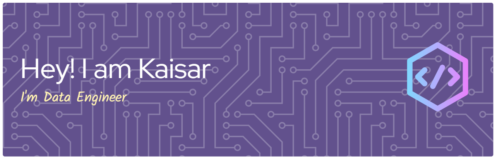

## Hi there 👋

- 🔭 I’m currently working on Home
- 🌱 I’m currently learning Everything

##### Skills

##### Connect With Me

##### My Github Stats

<picture>
  <source media="(prefers-color-scheme: dark)" srcset="https://raw.githubusercontent.com/Kaisarkai/Kaisarkai/output/pacman-contribution-graph-dark.svg">
  <source media="(prefers-color-scheme: light)" srcset="https://raw.githubusercontent.com/Kaisarkai/Kaisarkai/output/pacman-contribution-graph.svg">
  
</picture>